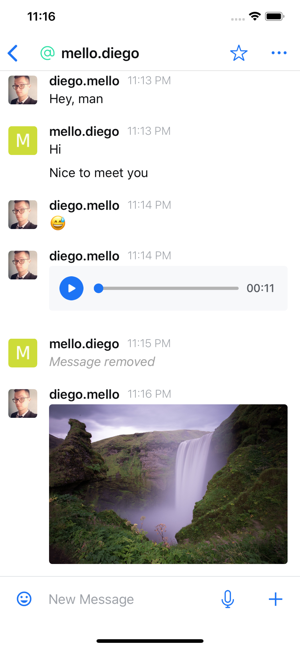
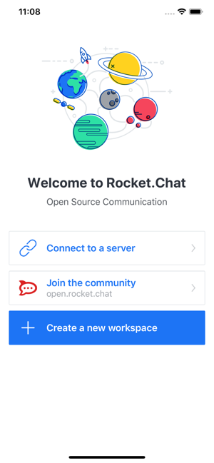
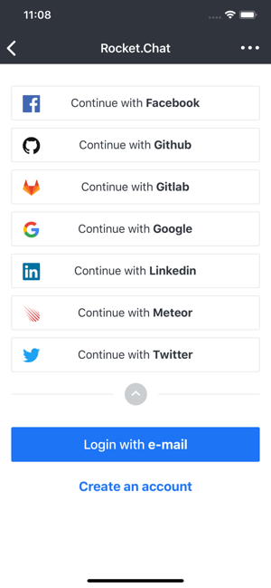
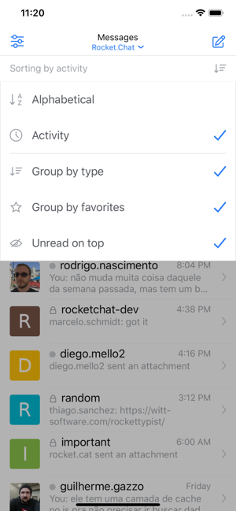
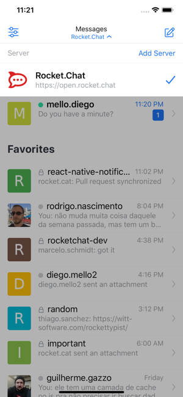
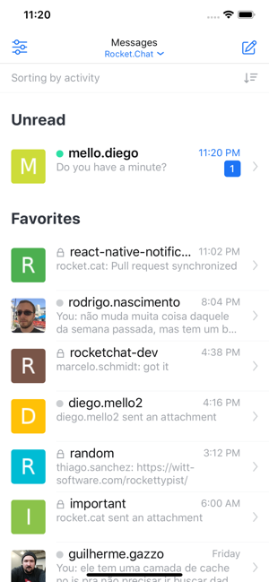

<h1 align="center"><b> Rocket.Chat React-Native App</b> </h1>

Rocket.Chat React Native Mobile

<i>"How to save a life?" - Rocket.Chat</i> 

  <a href="#blush-overview">Overview</a> •
  <a href="#dizzy-roadmap">Roadmap</a> •
  <a href="#wrench-install-instructions">Install</a> •
  <a href="#zap-tech-stack">Tech Stack</a> •
  <a href="#iphone-Test">Test</a> •
  <a href="#eyes-version">Version</a> •

  <kbd>
    
  </kbd>
  &nbsp;&nbsp;&nbsp;&nbsp;
  <kbd>
    
  </kbd>
  &nbsp;&nbsp;&nbsp;&nbsp;
  <kbd>
    
  </kbd>
    
  <kbd>
    
  </kbd>
    &nbsp;&nbsp;&nbsp;&nbsp;
  <kbd>
    
  </kbd>
    &nbsp;&nbsp;&nbsp;&nbsp;
  <kbd>
    
  </kbd>

## :blush: **Overview?**

| Feature                                                   	    | Status 	|
|---------------------------------------------------------------	|--------	|
| Jitsi Integration                                             	| ❌    	|
| Federation (Directory)                                        	| ❌    	|
| Threads                                                       	| ❌    	|
| Record Audio                                                  	| ✅    	|
| Record Video                                                  	| ❌    	|
| Commands                                                      	| ❌    	|
| Draft message per room                                        	| ❌    	|
| Share Extension                                               	| ❌    	|
| Notifications Preferences                                     	| ✅    	|
| Edited status                                                 	| ✅    	|
| Upload video                                                  	| ❌    	|
| Grouped messages                                              	| ✅    	|
| Mark room as read                                             	| ❌    	|
| Mark room as unread                                           	| ❌    	|
| Tablet Support                                                	| ❌    	|
| Read receipt                                                  	| ❌    	|
| Broadbast Channel                                             	| ✅    	|
| Authentication via SAML                                       	| ❌    	|
| Authentication via CAS                                        	| ❌    	|
| Custom Fields on Signup                                       	| ❌    	|
| Report message                                                	| ❌    	|
| Theming                                                       	| ❌    	|
| Settings -> Review the App                                    	| ❌    	|
| Settings -> Default Browser                                   	| ❌    	|
| Admin panel                                                   	| ❌    	|
| Reply message from notification                               	| ❌    	|
| Unread counter banner on message list                         	| ✅    	|
| E2E                                                           	| ❌    	|
| Join a Protected Room                                         	| ❌    	|
| Optional Analytics                                            	| ❌    	|
| Settings -> About us                                          	| ❌    	|
| Settings -> Contact us                                        	| ❌    	|
| Settings -> Update App Icon                                   	| ❌    	|
| Settings -> Share                                             	| ❌    	|
| Accessibility (Medium)                                        	| ❌    	|
| Accessibility (Advanced)                                      	| ❌    	|
| Authentication via Meteor                                     	| ❌    	|
| Authentication via Wordpress                                  	| ❌    	|
| Authentication via Custom OAuth                               	| ❌    	|
| Add user to the room                                          	| ✅    	|
| Send message                                                  	| ✅    	|
| Authentication via Email                                      	| ✅    	|
| Authentication via Username                                   	| ✅    	|
| Authentication via LDAP                                       	| ✅    	|
| Message format: Markdown                                      	| ✅    	|
| Message format: System messages (Welcome, Message removed...) 	| ✅    	|
| Message format: links                                         	| ✅    	|
| Message format: images                                        	| ✅    	|
| Message format: replies                                       	| ✅    	|
| Message format: alias with custom message (title & text)      	| ✅    	|
| Messages list: day separation                                 	| ✅    	|
| Messages list: load more on scroll                            	| ✅    	|
| Messages list: receive new messages via subscription          	| ✅    	|
| Subscriptions list                                            	| ✅    	|
| Segmented subscriptions list: Favorites                       	| ✅    	|
| Segmented subscriptions list: Unreads                         	| ✅    	|
| Segmented subscriptions list: DMs                             	| ✅    	|
| Segmented subscriptions list: Channels                        	| ✅    	|
| Subscriptions list: update user status via subscription       	| ✅    	|
| Numbers os messages unread in the Subscriptions list          	| ✅    	|
| Status change                                                 	| ✅    	|
| Upload image                                                  	| ✅    	|
| Take picture & upload it                                      	| ✅    	|
| 2FA                                                           	| ✅    	|
| Signup                                                        	| ✅    	|
| Autocomplete with usernames                                   	| ✅    	|
| Autocomplete with @all & @here                                	| ✅    	|
| Autocomplete room/channel name                                	| ✅    	|
| Upload audio                                                  	| ✅    	|
| Forgot your password                                          	| ✅    	|
| Login screen: terms of service                                	| ✅    	|
| Login screen: privacy policy                                  	| ✅    	|
| Authentication via Google                                     	| ✅    	|
| Authentication via Facebook                                   	| ✅    	|
| Authentication via Twitter                                    	| ✅    	|
| Authentication via GitHub                                     	| ✅    	|
| Authentication via GitLab                                     	| ✅    	|
| Authentication via LinkedIn                                   	| ✅    	|
| Create channel                                                	| ✅    	|
| Search Local                                                  	| ✅    	|
| Search in the API                                             	| ✅    	|
| Settings -> License                                           	| ✅    	|
| Settings -> App version                                       	| ✅    	|
| Autocomplete emoji                                            	| ✅    	|
| Upload file (documents, PDFs, spreadsheets, zip files, etc)   	| ✅    	|
| Copy message                                                  	| ✅    	|
| Pin message                                                   	| ✅    	|
| Unpin message                                                 	| ✅    	|
| Channel Info screen -> Members                                	| ✅    	|
| Channel Info screen -> Pinned                                 	| ✅    	|
| Channel Info screen -> Starred                                	| ✅    	|
| Channel Info screen -> Uploads                                	| ✅    	|
| Star message                                                  	| ✅    	|
| Unstar message                                                	| ✅    	|
| Channel Info screen -> Topic                                  	| ✅    	|
| Channel Info screen -> Description                            	| ✅    	|
| Star a channel                                                	| ✅    	|
| Message format: videos                                        	| ✅    	|
| Message format: audios                                        	| ✅    	|
| Edit message                                                  	| ✅    	|
| Delete a message                                              	| ✅    	|
| Reply message                                                 	| ✅    	|
| Quote message                                                 	| ✅    	|
| Muted state                                                   	| ✅    	|
| Offline reading                                               	| ✅    	|
| Offline writing                                               	| ✅    	|
| Edit profile                                                  	| ✅    	|
| Reactions                                                     	| ✅    	|
| Custom emojis                                                 	| ✅    	|
| Accessibility (Basic)                                         	| ✅    	|
| Tap notification, go to the channel                           	| ✅    	|
| Deep links: Authentication                                    	| ✅    	|
| Deep links: Rooms                                             	| ✅    	|
| Full name setting                                             	| ✅    	|
| Read only rooms                                               	| ✅    	|
| Typing status                                                 	| ✅    	|
| Create channel/group                                          	| ✅    	|
| Disable registration setting                                  	| ✅    	|
| Unread red line indicator on message list                     	| ✅    	|
| Search Messages in Channel                                    	| ✅    	|
| Mentions List                                                 	| ✅    	|
| Attachment List                                               	| ✅    	|
| Join a Room                                                   	| ✅    	|

## :dizzy: **Roadmap**

-   [x] Make it work on IOS
-   [x] Make it work on Android
-   [x] Make it work on Expo
-   [x] Transform into responsive
-   [x] Update to latest React Native version

## :wrench: **Install instructions**

### Getting Started

#### 1) Clone & Install Dependencies

- 1.1) `git clone https://github.com/funnyjerry/react-native-websocket-chat-app.git`
- 1.2) `cd react-native-websocket-chat-app` - cd into your newly created project directory.
- 1.3) Install NPM packages with `yarn install`
        **Note:** NPM has issues with React Native so `yarn` is recommended over `npm`.
- 1.4) **[iOS]** `cd ios` and run `pod install` - if you don't have CocoaPods you can follow [these instructions](https://guides.cocoapods.org/using/getting-started.html#getting-started) to install it.
- 1.5) **[Android]** If you haven't already generated a `debug.keystore` file you will need to complete this step from within the `/android/app` folder. Run `keytool -genkey -v -keystore debug.keystore -storepass android -alias androiddebugkey -keypass android -keyalg RSA -keysize 2048 -validity 10000`

#### 2) Start your app

- 2.1) **[iOS]** Build and run the iOS app, run `react-native run-ios` (to run on simulator) or `react-native run-ios --device` (to run on real device) from the root of your project. The first build will take some time.
- 2.2) **[Android]** If you haven't already got an android device attached/emulator running then you'll need to get one running (make sure the emulator is with Google Play / APIs). When ready run `react-native run-android` from the root of your project.

## :zap: **Tech Stack**

<h1 align="center">
  
  
  
  
   
</h1>

-   [React Native](https://github.com/facebook/react-native)
-   [Redux](https://github.com/reduxjs/react-redux)
-   [Redux-Persist](https://github.com/rt2zz/redux-persist)
-   [Lottie React Native](https://github.com/react-native-community/lottie-react-native)
-   [Rocket Chat](https://github.com/FaridSafi/react-native-gifted-chat)
-   [Eslint](https://eslint.org/)
-   [Facebook Login](https://github.com/facebook/react-native-fbsdk)

## :iphone: **Test**

- [x] Test on Android
- [x] Test on iOS

## :eyes: **Version**
- [x] React-Native 0.58.6
- [ ] Expo
